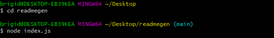
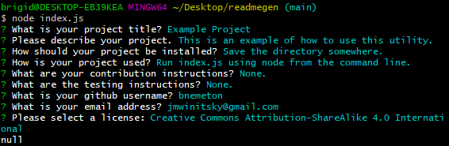
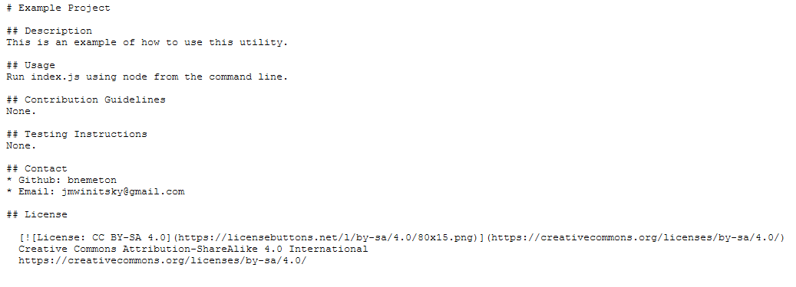

# README Generator

## Description
A simple command line utility to generate a usable README for the user's project.

## Usage
Once in the project directory, run the index.js using Node. Answer the questions it prompts you with, and then afterwards move the README it generates to wherever you need it.

### Screenshots

### Video
The video is too large to upload to github or to include as a GIF, but can be found at this link: https://drive.google.com/file/d/17AxfxLrAwEllmDMdBkwHx6TUn8CDKWqR/view?usp=sharing

## Contact
* Github: bnemeton
* Email: jmwinitsky@gmail.com

  
